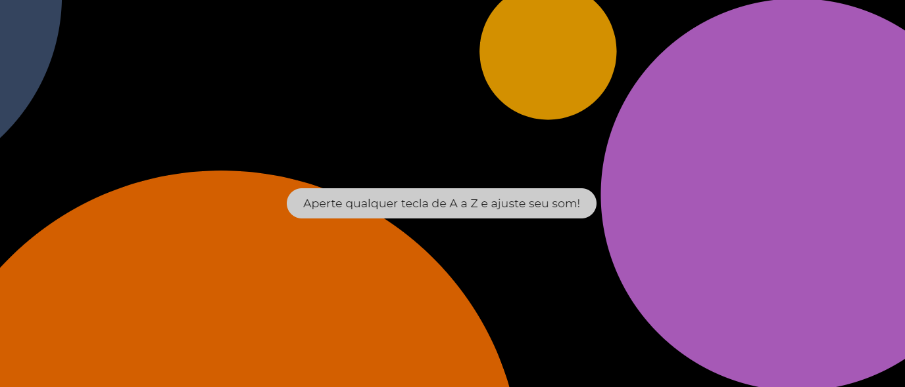

# Patatap Clone

Clone of famous Patatap app

---

## What is Patatap?

From Wikipedia:

> Patatap consists of unique palettes of colors, sounds, and shapes that are altered via the spacebar. The 26 melodic and rhythmic sounds that are in each set are triggered by pressing the A to Z keys. All of the sounds present a visual animation over the background when played. A writer for Co.design described the audio textures as ranging from "bells and snaps to pew-pewing lasers and alien spaceship landings."

- [Check original](https://patatap.com/)

---

## How to use?

- Press any key
- That's it!

---

## Installation

- [No need! Check it on GitHub Pages!](https://milenayamamoto.github.io/patatap-clone)

### Clone

- 👯 Clone this repo to your local machine using `https://github.com/milenayamamoto/patatap-clone.git`

---

## Built With

- [Paper.js](http://paperjs.org/)

- [Made during Colt Steel's The Web Developer Bootcamp on Udemy](https://www.udemy.com/course/the-web-developer-bootcamp/)
